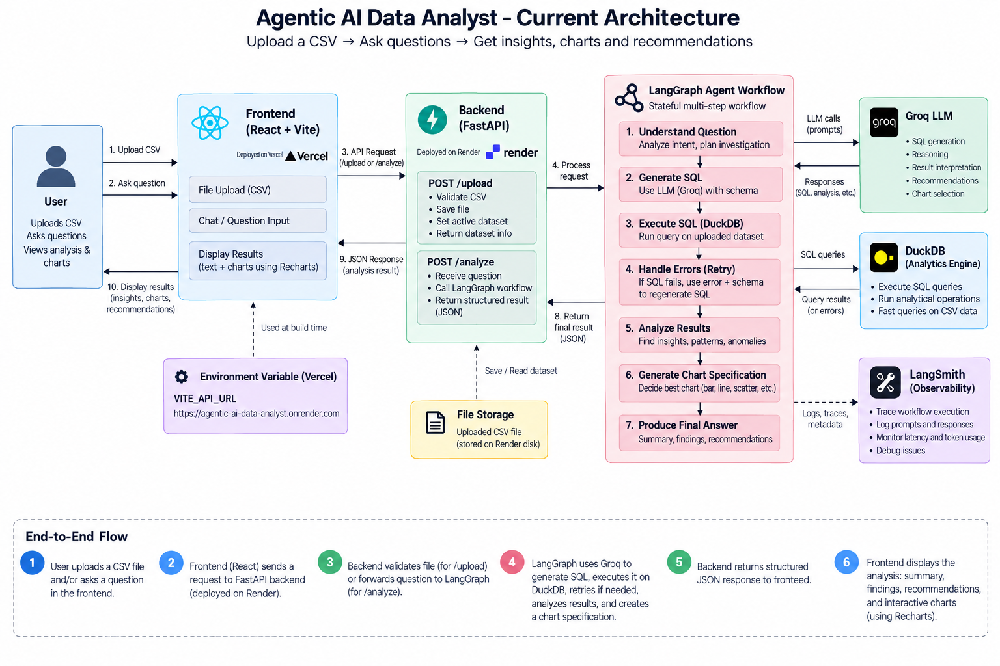

## Agentic AI Data Analyst --- Compact Project Context

Project

AI-powered CSV analysis application.

User uploads a CSV and asks natural-language questions.

Returns summary, findings, evidence, recommendations, and
interactive charts.

Generic dataset support; not limited to sales data.

Portfolio/demo deployment, not yet a large multi-user SaaS.
 ## Stack

Frontend: React + Vite + Recharts.

Backend: Python + FastAPI.

Agent: LangGraph.

LLM: Groq.

Analytics: DuckDB.

Observability: LangSmith.

Frontend hosting: Vercel.

Backend hosting: Render. ## Live Deployment

Frontend: https://agentic-ai-data-analyst.vercel.app/

Backend: https://agentic-ai-data-analyst.onrender.com

Health: https://agentic-ai-data-analyst.onrender.com/health

 ## Current Architecture-

React renders the answer and chart. 
## LangGraph Workflow

Question
  ↓
Understand / Plan
  ↓
Generate SQL
  ↓
Execute SQL with DuckDB
  ↓
SQL error?
  ├─ Yes → Error + Schema → Regenerate SQL → DuckDB
  └─ No
       ↓
Analyze Results
       ↓
Generate ChartSpec
       ↓
Final Answer
       ↓
Structured JSON

 ## Why LangGraph?

Workflow requires multiple steps, not one LLM call.

Maintains shared state between nodes.

Supports SQL error/retry paths.

Coordinates reasoning and tool execution.

Produces structured results. 
## Responsibility Separation Component
Role ----------- ------------------------------ React UI Recharts
Visualization FastAPI API, upload, validation LangGraph Agent
orchestration/state Groq LLM reasoning/SQL generation DuckDB
Deterministic computation LangSmith Tracing/observability Core
principle:

LLM = reasoning
DuckDB = computation
LangGraph = orchestration
FastAPI = API
React = presentation
LangSmith = observability

Why DuckDB?

Analytical workload is tabular.

SQL is appropriate for data analysis.

Provides deterministic calculations.

Avoids asking the LLM to calculate large datasets.

Workflow is:

CSV → DuckDB → compact result → LLM → explanation

Why Groq?

Provides LLM inference.

Used for reasoning, SQL generation, result interpretation,
recommendations, and chart selection.

It is not the computation engine. ## Schema-Driven Design

No hardcoded sales-only schema.

Uploaded dataset schema becomes part of agent context.

SQL is generated from actual columns.

Same workflow can handle different CSV structures. 
## SQL
Reliability Problem Problem: - LLM may generate invalid SQL or
incorrect column names. Solution: - Provide real schema. - Execute
SQL through DuckDB. - Capture database errors. - Feed error +
schema + previous SQL back to the SQL-generation step. - Retry a
limited number of times. Interview answer: > "Because SQL
generation is probabilistic, I implemented an error-aware retry
loop. DuckDB errors are fed back with the schema so the model can
correct the query." 

## Latency Problem Problem: - 
Multiple
sequential LLM calls increased response time. Improvements: -
Reduced unnecessary LLM calls. - Simplified prompts. - Avoided
unnecessary dataset content. - Delegated deterministic work to
DuckDB. - Used LangSmith to identify expensive steps. Observed
typical latency: - Approximately 4--9 seconds depending on
query/workflow path.

 ## Token Usage Problem Problem: - 
 Sending raw
CSV rows to the LLM increases tokens and latency. Solution: - DuckDB
performs computation first. - LLM receives schema and compact query
results. - Large raw datasets are not sent unnecessarily. Observed
graph runs: - Approximately 1.8k--4.7k tokens depending on analysis.

## Dynamic Visualization Backend returns a ChartSpec rather than
a static image. Example:

{
  "type": "scatter",
  "title": "Age vs Total Amount",
  "x_axis": "Age",
  "y_axis": "Total Amount",
  "data": []
}

Supported: - bar - line - pie - histogram - scatter - none
Flow:

Backend → ChartSpec → React ChartRenderer → Recharts

Frontend Chart Issue

Scatter rendering initially had issues.

xKey and yKey needed to come from ChartSpec.

Cell needed to be imported where used.

Renderer uses:

const chart = result?.chart;
const data = chart?.data || [];
const xKey = chart?.x_axis;
const yKey = chart?.y_axis;

Lesson: - Backend/frontend need a clear structured contract. ## CORS
Local: - React: localhost:5173 - FastAPI: 127.0.0.1:8000
Production: - React: Vercel - FastAPI: Render Because origins differ,
FastAPI CORS is configured for:

allow_origins=[
    "http://localhost:5173",
    "https://agentic-ai-data-analyst.vercel.app"
]

API Configuration

Frontend:

const API_URL = import.meta.env.VITE_API_URL;

Local:

VITE_API_URL=http://127.0.0.1:8000

Production:

VITE_API_URL=https://agentic-ai-data-analyst.onrender.com

Calls:

fetch(`${API_URL}/analyze`, ...)
fetch(`${API_URL}/upload`, ...)

Important: - VITE_* values are exposed to the browser. - Never put
secrets in them. ## Backend Secrets

GROQ_API_KEY=...
LANGSMITH_API_KEY=...
LANGSMITH_TRACING=true
LANGSMITH_PROJECT=AI-Data-Analyst

Secrets stay on Render/backend.

Frontend only needs the public backend URL. ## Deployment
Frontend: - Vercel. - Root: frontend/Frontend. - Install:
npm install. - Build: npm run build. - Output: dist.
Backend: - Render Python service. - Root: backend. - Build:
pip install -r requirements.txt. - Start:

uvicorn main:app --host 0.0.0.0 --port $PORT

Health check: /health.

Docker is not currently required. ## API Endpoints ### Health

GET /health

Returns:

{"status":"ok"}

Upload

POST /upload

Multipart CSV upload.

CSV required.

50 MB maximum. ### Analyze

POST /analyze

Request:

{"question":"Show the average amount by category"}

Response includes: - summary - findings - evidence -
recommendations - chart - final_answer 

## Current Production
Error Being Investigated Production previously showed:
Unexpected token 'T', "The page c..." is not valid JSON Meaning: -
Frontend expected JSON. - /analyze returned non-JSON text/HTML. -
Original code used response.json() directly. Debugging approach:

const text = await response.text();

Then inspect/parse the response to identify whether it is a 404, 500,
HTML page, or another server response. Do not mark this as solved until
confirmed. 

## LangSmith Used for: -
 workflow tracing - node latency -
LLM calls - prompts/responses - token usage - SQL errors - retries -
failures It helped identify latency and token-usage bottlenecks. 

## Current Limitations - active_dataset is shared at application level. -
Uploaded files are stored on application disk. - Analysis is
synchronous. - No complete authentication/authorization. - No
distributed job queue. - Limited horizontal scaling. - Current system is
suitable for portfolio/demo use, not full multi-tenant SaaS. 

## Production-Level Target

Users
  ↓
CDN / WAF
  ↓
API Gateway / Load Balancer
  ↓
Scalable FastAPI
  ↓
Message Queue
  ↓
Analysis Workers
  ↓
LangGraph + DuckDB + Groq
  ↓
Result Storage
  ↓
React

Storage/services: - PostgreSQL: users, datasets, history, permissions,
job state. - Object Storage: persistent CSV/Parquet files. - Redis:
caching, sessions, rate limits, reusable results. - Multiple API/worker
instances: horizontal scaling. - Monitoring/logging/alerting: operations
and reliability. ## Six Major Production Improvements ### 1.
Multi-user Dataset Isolation - Replace global active dataset with
user/session-aware dataset_id. - Prevent cross-user dataset access.

### 2. Object Storage - Store uploads in S3-compatible/cloud object
storage. - Provides persistence and scalable file access.

 ### 3.Asynchronous Processing

API → Queue → Worker → LangGraph/DuckDB/LLM

Return job_id immediately.

Frontend checks status or receives progress.
 ### 4. Horizontal Scaling

Multiple FastAPI instances behind a load balancer.

Scale analysis workers independently.

Autoscale based on workload. ### 5. PostgreSQL + Redis

PostgreSQL: users, metadata, history, permissions, jobs.

Redis: cache, short-term state, rate-limit counters, reusable
results.
 ### 6. Security + Observability

Authentication/authorization.

Rate limiting.

Input validation/sanitization.

Read-only SQL access.

Query timeouts/resource limits.

Centralized logs, metrics, alerts, error tracking.

CI/CD and automated testing. 

##Summary-

-Built an agentic AI data-analysis system using LangGraph, LLMs, and DuckDB.
-Learned to design LLM + SQL workflows, including schema-driven SQL generation and error-based retries.
-Learned full-stack development and deployment with React, FastAPI, Vercel, Render, and REST APIs.
-Learned practical performance, observability, and production architecture concepts like latency/token optimization, LangSmith, caching, queues, workers, and scaling.